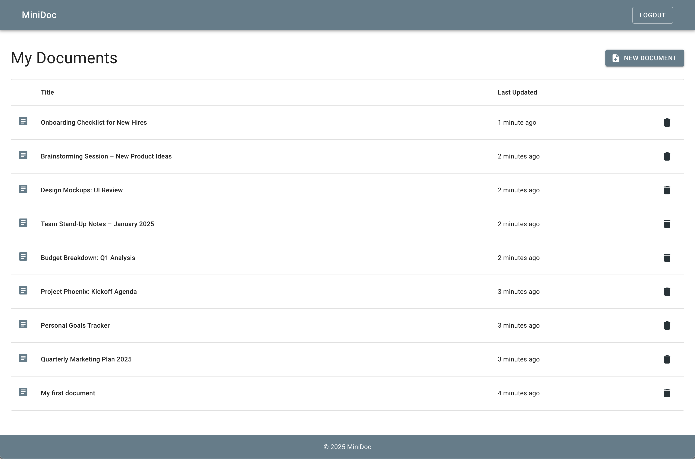
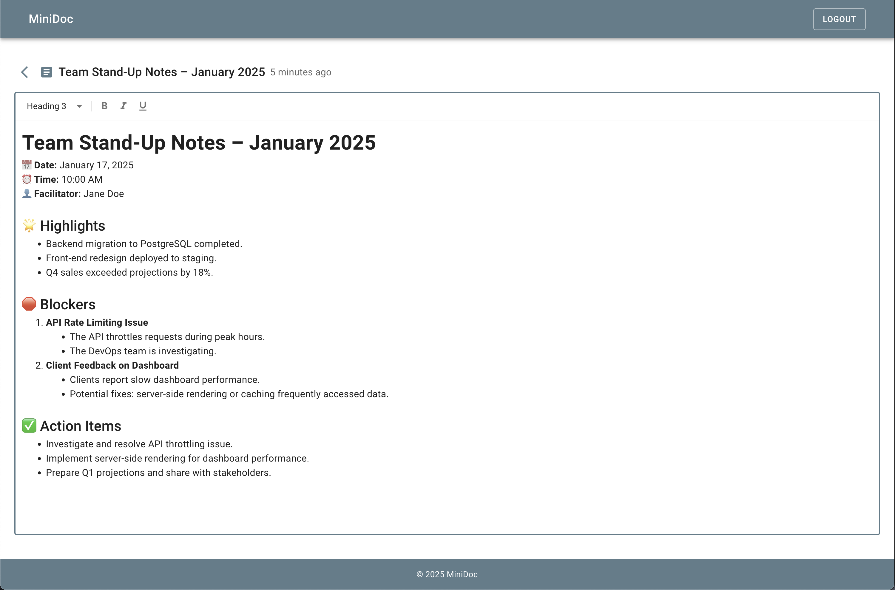
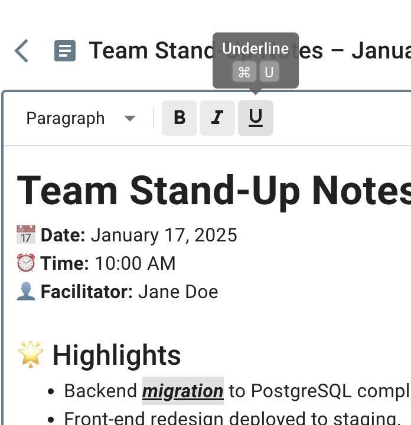
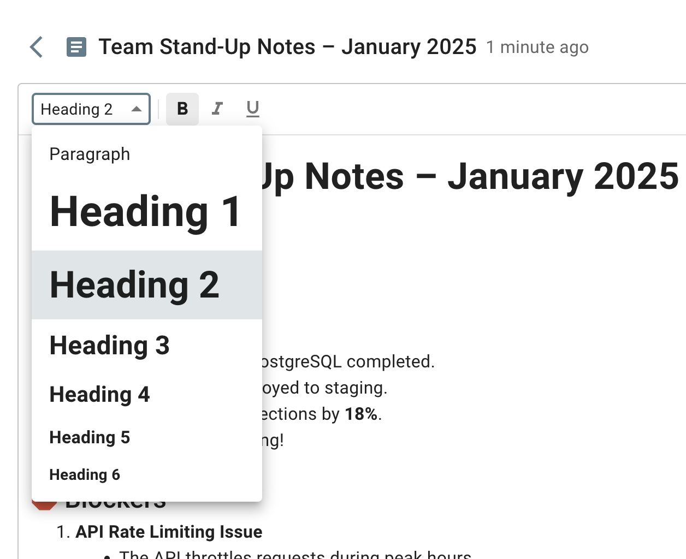
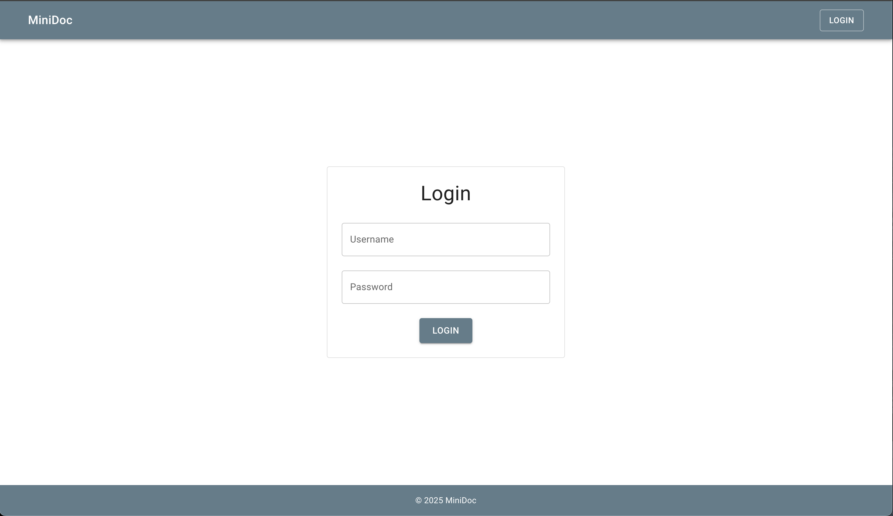

# MiniDoc

A mini(mal) replica of Google Docs.

## Table of Contents

1. Overview
2. Setup and Installation
3. Technical Decisions
4. Scalability
5. Future Improvements
6. Screenshots
7. References

## 1. Overview

### Stack

This full-stack application is powered by a **Django** backend and **Vite.js (React)** frontend. Fully Dockerized, it comes with a self-contained **PostgreSQL** database, which minimizes the need for manual setup. Redis is also included to enable real-time collaboration across multiple clients and sessions.

### Features

- **Authentication \& Authorization**: users are able to log in and out and only create/modify documents unless if they are authenticated.
- **Real-time, Rich-text Collaboration**: changes to documents' content and titles display instantly for all users.
- **Data Storage**:
  - Documents persist between sessions.
    - Simply hit Cmd+S / Ctrl+S to save your work.
    - Navigating away from the page also automatically saves your changes.
  - User passwords are hashed using Django's built-in `make_password` utility (`django.contrib.auth.hashers`). This is handled by Django's native `User` model.
  - A containerized database allows for minimal setup and easy cleanup. Simply run the following command when you're finished testing out MiniDoc:

        docker-compose down && docker volume rm $(docker volume ls -q | grep "minidoc_")

## 2. Setup and Installation

1. Ensure you have Docker installed and running on your machine.
2. After cloning this repository, simply `cd` into the `minidoc` directory and run:

        docker-compose up --build

3. Once the `minidoc_web` container finishes starting up, visit [http://localhost:5173](http://localhost:5173) in your browser.
4. You will be redirected to the login page, where you'll be able to log in with any one of these users:

    | Username | Password |
    |----------|----------|
    | user1    | pass123  |
    | user2    | pass123  |
    | user3    | pass123  |
    | user4    | pass123  |
    | user5    | pass123  |

5. You're good to go!

## 3. Technical Decisions

### Real-time Collaboration

1. User visits the Document Editor page to create or edit a document.
    -  If creating a document, a new UUID is instantly generated.
2. A WebSocket connection is established with the API, which is facilitated by a Django Channels Consumer.
3. Given the `documentId` sent to the backend, the Consumer attempts to query for existing documents and automatically creates a new database record if it fails to find one.
4. Should the document exist, its binary content is loaded into the local document structure.
    - This binary data represents the current state of changes in the collaborative document, encoded as a serialized **Conflict-free Replicated Data Type (CRDT)**.
    - This ensures that updates can be merged seamlessly across distributed peers without conflicts.
    - [YDoc](https://github.com/y-crdt/ypy) was the utility of choice for this function due to its simplicity and integration with its [TypeScript counterparts](https://github.com/yjs/yjs).
    - More on CRDTs below.
5. When users make changes to a document's content, the changes are merged in the consumer on every keystroke.
    - Redis allows the server to broadcast all events to all users connected to the document in near real-time.
6. All document content changes are transmitted as `bytes`, while changes to the title and "save" events are exchanged as serialized JSON objects.
7. When the final client disconnects from the WebSocket session, the document is automatically saved.

### What are CRDTs?

- CRDTs are data structures designed for distributed systems that allow multiple replicas of data to exist across a network.
- They enable independent and concurrent updates to replicas without requiring coordination between them.
- Conflicts are automatically handled by built-in algorithms.
- Replicas may temporarily differ but are guaranteed to converge to the same state over time.
- Notable adaptors include Apple (Notes app), Facebook, SoundCloud, TomTom, and [many more](https://en.wikipedia.org/wiki/Conflict-free_replicated_data_type#Industry_use).

### Why Django?

- Django is a reliable and well-established framework, offering a comprehensive suite of built-in tools and features.
- The ease of setting up Django Rest Framework, configuring authentication, and defining models/schemas made it the clear and logical choice.

## 4. Scalability

### Current Scalability

- **Django**: Supports horizontal scaling via load balancers and multiple instances.
- **PostgreSQL database**:
    - Can handle increasing read loads using read replicas.
    - Provides robust support for handling concurrent requests and scalable data storage.
- **Redis**:
    - Minimizes latency for real-time collaboration features.
    - Acts as a fast in-memory cache and messaging layer for CRDT updates.
- **Docker**: Each service runs in its own container, which allows for easy deployment and replication.

### Going Further

- **AWS Lambda** in place of Django endpoints, using AWS API Gateway to route requests to these functions.
- **Amazon Aurora Serverless** in place of a Docker container or AWS RDS instance. Offers on-demand, autoscaling database configuration and supports PostgreSQL.
- **Amazon Cognito** for managing user authentication and permissions.
- **Amazon DynamoDB** for storing document metadata, CRDT snapshots, historical edit data, etc.
- **AWS Amplify** for static frontend hosting.
- **Dedicated WebSocket Server** (Django Channels, FastAPI, or Node.js) to handle real-time collaboration.
    - Using API Gateway WebSocket APIs would also be an effective solution, though it could increase the complexity of CRDT management.

### What if going serverless isn't an option?

- **Load balancing** (AWS ELB) and **container orchestration** (Kubernetes) for dynamically scaling instances.
- **Database sharding** can be implemented to handle larger datasets and improve query performance.
- **Redis clustering** would manage higher volumes of collaborative CRDT updates and caching demands.

## 5. Future Improvements

- [ ] **Document permissions**: Users will only be able to view and edit a document if they own it or have been invited to collaborate on it.
- [ ] **Extract readable text from YDoc**: Allow the user to view brief snippets of their documents in their dashboard.
- [ ] **Multi-staged Docker builds**: This will improve the build times and image sizes.
- [ ] **Automatic saving**: Save changes after 5 seconds of inactivity.
- [ ] **Attachments**: Insert images and shapes/vectors into the document.
- [ ] **Real-time notifications**: Notify collaborators in real-time when changes are made to shared documents.
- [ ] **Live cursors**: Display live cursors and collaborator names in real-time, similar to Google Docs, to enhance collaboration.
- [ ] **Version history**: Allow users to view and revert to previous versions of a document.
- [ ] **Offline support**: Enable users to make edits offline and sync changes once back online.
- [ ] **Dark mode support**
- [ ] **Analytics and insights**: Add analytics for document activity, such as edit history, collaborator contributions, and time spent on documents.
- [ ] **Mobile optimization**: Ensure a seamless experience for mobile users through responsive design or a dedicated app.
- [ ] **More options in the editor toolbar**: Add more formatting options.

## 6. Screenshots

[Video demo of collaboration feature](https://youtu.be/i6Db8MnA8qQ)

  
  
  
  
  

## 7. Inspiration

[A simple way to build collaborative web apps](https://news.ycombinator.com/item?id=28209736)
